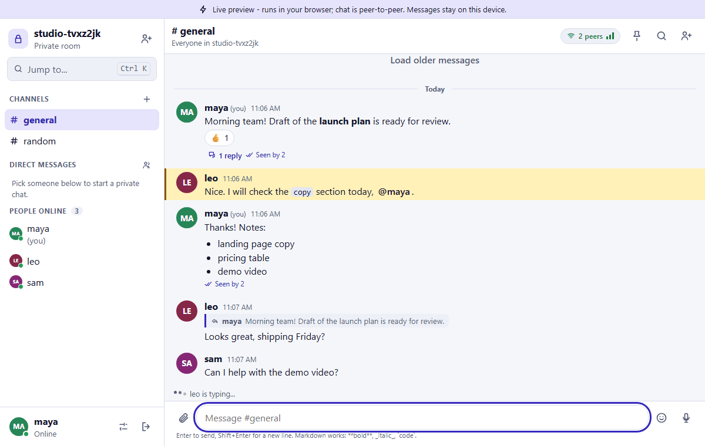
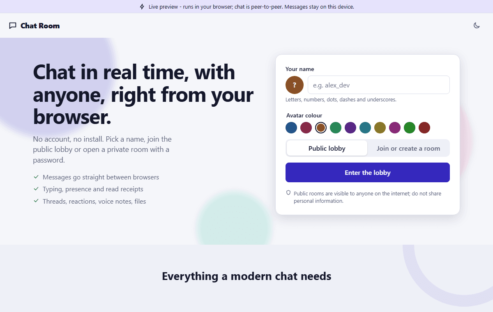
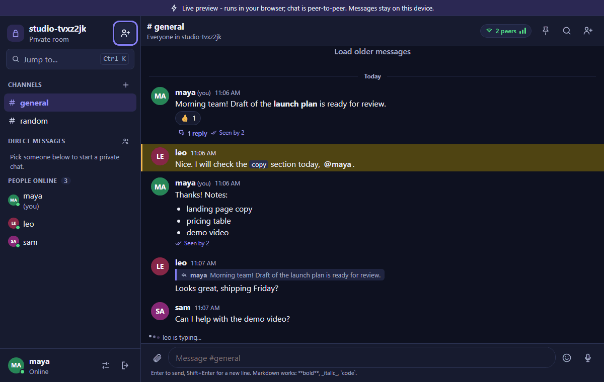
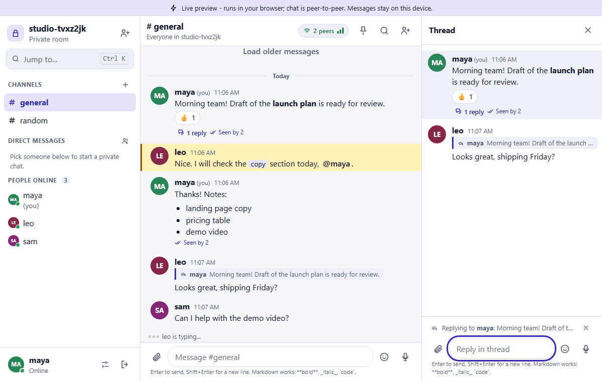
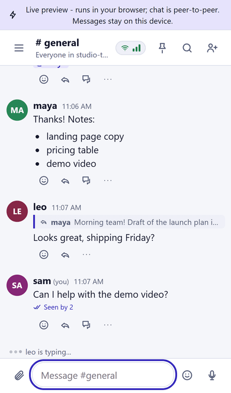

# Chat Room

A real-time chat room that feels like a modern messenger: live presence, typing indicators, read receipts, threads, reactions, voice notes, files, direct messages and private rooms. It starts from the original idea (type a name, join a shared room, talk) and layers a full product on top.

It runs in two modes that share all of the UI and domain logic:

| Mode | Where | How messages travel | Data lives in |
| --- | --- | --- | --- |
| **Peer-to-peer** (default for the static site) | GitHub Pages, any static host | Browser to browser over encrypted WebRTC | IndexedDB in each browser |
| **Full stack** | Your own server or Docker | Socket.IO to an Express server | MongoDB |

Live preview: https://shishir19999.github.io/Chat-Room/ (peer-to-peer, no server).



| Landing | Dark theme | Thread | Phone |
| --- | --- | --- | --- |
|  |  |  |  |

## Features

- **Identity**: pick a name and colour, optional status text. A stable identity (an ECDSA key pair) is created in your browser; your user id is its fingerprint.
- **Rooms**: the public `lobby`, any named room, and password protected private rooms. Share an invite link (`#/join/<room>`, optionally with the password after the `#`). Channels inside a room, direct messages to anyone online, and small group chats (up to 8 people).
- **Live presence** (online, idle, away), **typing indicators**, **delivery and seen receipts** (sent, delivered, seen by N), unread counters, mention badges, a "new messages" divider and "jump to first unread".
- **Messages**: replies, threads, emoji reactions, edit and delete (with tombstones), pinned messages, search, load older history, date separators, grouping.
- **Rich text** with Markdown (bold, italic, code, code blocks with a copy button, lists, quotes), link chips that show only the domain, `@mentions` with highlights and autocomplete, jumbo emoji.
- **Emoji and stickers**: a bundled searchable emoji picker and sticker packs (no external service).
- **Attachments**: pictures (resized), files up to 5 MB and voice notes (waveform and duration). Nothing from other people loads until you tap it.
- **Notifications**: unread count in the tab title, optional sound, optional desktop notifications, screen reader announcements for new messages.
- **Resilience**: connection status and quality indicator, an offline banner, automatic reconnection and history catch-up. Several tabs of one browser keep working through BroadcastChannel when nothing else is reachable.
- **Safety**: per-sender rate limits, size caps, mute and block people, report and hide messages, optional family friendly word filter, strict sanitising of all content, and a notice that public rooms are visible to anyone.
- **Design**: tokens, light and dark themes plus accent colours, fully responsive (phone first, slide-over sidebar), keyboard shortcuts (`Ctrl+K` switcher, `Esc`, `Up` to edit the last message, `Shift+Enter` for a new line), reduced motion support. Parallax and scroll-reveal are used only on the landing page.
- **Practice bot**: in an empty room you can switch on a local helper to try every feature alone. It exists only on your device.

## Architecture

```
React UI  ->  ChatEngine (domain logic)  ->  Transport  ->  peers / server
                    |                           |- p2p     (trystero over WebRTC)
                    |                           |- socket  (Socket.IO)
                    v                           |- memory  (tests)
               Store (IndexedDB)
```

- **Everything is an operation.** Messages, edits, deletes, reactions, pins, read markers, channel and group definitions are small immutable ops with an id, a hybrid logical clock (`lc`), a wall clock and an author. The state is a pure reducer over ops (`Frontend/src/core/state.js`): applying the same ops in any order, any number of times, gives the same result. Ordering is by clock, then wall time, then id; duplicates are ignored; edits and reactions that arrive before their message wait for it.
- **Transport interface** (`Frontend/src/transport`): `join`, `leave`, `sendOp`, `sendEph` (typing, presence), `requestHistory`, `publishBlob` / `fetchBlob`, plus events for status, peers, ops and ephemeral messages. The UI and the engine never know which implementation runs.
- **Peer-to-peer transport** uses [trystero](https://github.com/dmotz/trystero) (no accounts, no keys). Peers find each other through public relays (Nostr first; BitTorrent trackers and then MQTT brokers are tried if nobody is found or the relays are unreachable), then talk directly over encrypted WebRTC data channels. A room password feeds trystero's password option, so private rooms are not even discoverable without it. The connection status in the header shows the strategy, peer count and round-trip time.
- **Signed ops.** In peer-to-peer mode each op is signed (ECDSA P-256) and the user id is the key fingerprint. Peers can therefore relay history for each other without being able to forge or change anyone's messages, and only the author can edit or delete a message.
- **History in a serverless chat.** Every browser keeps the ops it has seen in IndexedDB. When a peer joins, both sides exchange a signed hello and then ask each other for ops newer than they have (private conversations are only served to their members). "Load older" first reads the local store, then asks peers.
- **Socket mode** stores the same ops in MongoDB (`Op`, `Workspace`, `User`, `Upload`, `Report`). The server validates every op, checks authorship and membership, relays it and answers history requests. Protocol events live in one module, `Backend/events.js` (a verbatim copy sits in `Frontend/src/transport/socketEvents.js`; a test fails if they drift).

### Why peer-to-peer on a static site

GitHub Pages has no server, so a normal chat server is impossible. WebRTC lets browsers talk directly; only the first handshake goes through public relays, and the chat data never touches them.

### Limits of peer-to-peer

- People must be online at the same time to exchange messages; there is no server to hold them. Messages you send while alone are kept on your device and delivered when someone connects.
- History is per browser. Clearing site data removes it, and a new device starts empty (until peers send recent history).
- Discovery relays are public infrastructure and can be down or blocked. Strict corporate networks or symmetric NATs may need a TURN server (`turnConfig` in `Frontend/src/transport/p2p.js`).
- The browser must support WebRTC.
- "Seen by" and "delivered" receipts are switched off for delivery in rooms with more than 12 connected peers.

## Safety notes

- Public rooms are visible to anyone on the internet. Do not share personal information (the app says so in public rooms).
- All user content is escaped: Markdown is rendered with `marked`, sanitised with `DOMPurify` and then decorated; raw HTML is shown as text, images are never embedded, only `http(s)` and `mailto` links work and they show just the domain.
- Peers cannot push oversized or malformed data: every op is validated, sizes are capped, senders are rate limited, and attachments are only fetched when you ask.
- Mute, block and "report and hide" are local controls. In socket mode a report is also stored for the server owner.
- Full-stack mode: salted scrypt password hashes, identity binding per user id, upload type checks by file signature, 5 MB limit, safe download headers, per-socket rate limits.

## Setup

Requirements: Node 24, MongoDB for full-stack mode.

```bash
# full stack
cd Backend && npm install && cp .env.example .env     # PORT, MONGODB_URL, CORS_ORIGIN
npm run dev
cd Frontend && npm install && cp .env.example .env    # VITE_API_URL must match the backend port
npm run dev

# static peer-to-peer site (no backend)
cd Frontend && npm run dev:demo         # development
npm run build:pages                     # production build for GitHub Pages (base /Chat-Room/, hash routing)
npm run preview:pages
```

Docker (MongoDB 8, Node 24 backend, nginx frontend):

```bash
cp .env.example .env     # optional: ports, CORS_ORIGIN, VITE_API_URL
docker compose up --build -d
```

## Scripts

| Where | Command | What it does |
| --- | --- | --- |
| Frontend | `npm run dev` / `dev:demo` | Vite dev server (full stack / peer-to-peer) |
| Frontend | `npm run build` / `build:pages` | Production build (full stack / GitHub Pages) |
| Frontend | `npm run lint` | ESLint, zero warnings allowed |
| Frontend | `npm test` | Vitest: reducer, clock, dedupe, history, receipts, tombstones, rate limiter, sanitizer, signatures, IndexedDB store, engine over a mocked transport |
| Backend | `npm start` / `npm run dev` | Run the server |
| Backend | `npm test` | Node test runner against a throwaway MongoDB database |
| Backend | `npm run seed` | Idempotent demo history for the lobby (about 400 messages) |

## Backend API

- Socket.IO events: see `Backend/events.js` (`join`, `op`, `eph`, `history`, `report`, and `peer-join`, `peer-leave`, `op`, `eph` from the server).
- `GET /rooms` public rooms with online counts, `GET /health`.
- `POST /uploads` (multipart, bearer token from the join reply, 5 MB, signature checked) and `GET /uploads/:id`.
